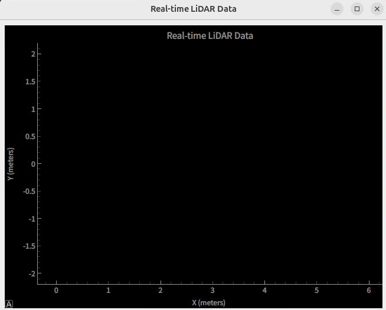
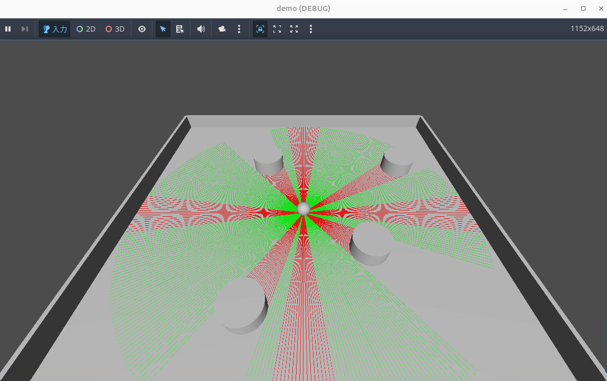
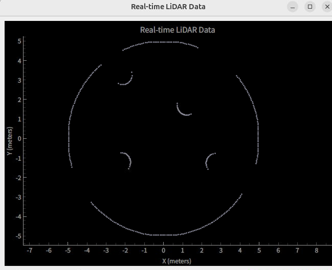

# Godot LiDAR: 箱庭とGodot EngineによるLiDARデモ

## 概要

箱庭とGodot Engine間における、箱庭PDUの共有メモリ通信を使用したLiDARシミュレーションのサンプルである。

- 箱庭のベース: [examples/PDU communication](https://github.com/toppers/hakoniwa-core-cpp-client)  
- Godot Engineのベース: [GDExtension C++ example](https://docs.godotengine.org/en/4.4/tutorials/scripting/gdextension/gdextension_cpp_example.html)
  ※チュートリアル一通り実施したあとに、箱庭との通信処理を追加

- 動作イメージ
  - Pythonプログラム側で箱庭アセット (LidarPython)を起動。
  - 箱庭アセット (LidarPython)が箱庭APIを使用して、共有メモリから点群データの読み込んでグラフを描画する。
  - Godot Engine側で箱庭アセット (Writer)を起動。
  - Godot Engine上でシミュレーションした点群データを箱庭PDUのLaserScan型に変換する。
  - 箱庭アセット (Writer)が箱庭APIを使用して、共有メモリに点群データの書き込みを行う。

- 動作環境 (参考)
  - OS: Ubuntu 24.04.3 LTS  
  - Godot Engine: バージョン4.4.1(Linux C#サポート版) ※事前に必須だがC#版でなくてもよい  
  - scons: バージョン4.5.2 ※事前に必須  

## Godotのalias (任意)

aliasにて、Godot Engineの実行ファイルを `godot` のコマンド名に設定する。ディレクトリは、Godot Engineをインストール時のディレクトリに合わせる。  
".bashrc" に記述することでログイン時に反映される。  
本手順は `godot` コマンドとして進める。

```bash
# 例）
alias godot='~/Godot/Godot_v4.4.1-stable_mono_linux_x86_64/Godot_v4.4.1-stable_mono_linux.x86_64'
```

## コンパイルおよびインストール手順

### 想定ディレクトリ構成

```txt
hakoniwa-godot-tutorial
├── godot_lidar
├── hakoniwa-core-cpp-client
```

### hakoniwa-godot-tutorialの用意

`--recursive` 指定して、サブモジュールも一緒にクローンをする。

```console
git clone --recursive https://github.com/esol-community/hakoniwa-godot-tutorial
```

### コンパイルおよびインストール

[箱庭インストール手順](https://github.com/esol-community/hakoniwa-core-cpp-client/tree/feature/godot_lidar/README.md#%E3%82%A4%E3%83%B3%E3%82%B9%E3%83%88%E3%83%BC%E3%83%AB%E6%89%8B%E9%A0%86)を参照（リポジトリのクローン手順以外を実施）。
一度、インストール手順を実施したあとは、次の手順のみ実施すればよい。

```console
cd hakoniwa-godot-tutorial/hakoniwa-core-cpp-client
bash build.bash
bash install.bash
```

`bash build.bash` でWarningが出力された場合は "core/CMakeLists.txt" を修正することで解消される。  
※試験するうえでは影響なし。

```log
CMake Warning (dev) at /usr/share/cmake-3.28/Modules/FetchContent.cmake:1331 (message):
  The DOWNLOAD_EXTRACT_TIMESTAMP option was not given and policy CMP0135 is
  not set.  The policy's OLD behavior will be used.  When using a URL
  download, the timestamps of extracted files should preferably be that of
  the time of extraction, otherwise code that depends on the extracted
  contents might not be rebuilt if the URL changes.  The OLD behavior
  preserves the timestamps from the archive instead, but this is usually not
  what you want.  Update your project to the NEW behavior or specify the
  DOWNLOAD_EXTRACT_TIMESTAMP option with a value of true to avoid this
  robustness issue.
Call Stack (most recent call first):
  core/src/CMakeLists.txt:17 (FetchContent_Declare)
This warning is for project developers.  Use -Wno-dev to suppress it.
```

"core/CMakeLists.txt" の修正イメージは次の通り。

```cmake
set(HAKO_CMAKE_VERSION 3.20)
cmake_minimum_required(VERSION ${HAKO_CMAKE_VERSION})

if(POLICY CMP0135)                : 追加
  cmake_policy(SET CMP0135 NEW)   : 追加
endif()                           : 追加

project(hakoniwa-core
    VERSION 1.0.0
    DESCRIPTION "hakoniwa-core project"
    LANGUAGES C CXX
)
```

### メタデータ生成

次のコマンド実行したディレクトリに "extension_api.json" ファイルが作成される。  
Godot Engineの起動が必要なため、SSHなどではなくデスクトップ画面から実行すること。

```console
cd hakoniwa-godot-tutorial/godot_lidar/godot-cpp
godot --dump-extension-api
```

### godot-cppのコンパイル

godot-cpp配下の更新は、行わないため、一度コンパイルすると本手順はほとんど実施しない。  
platformは、linux、custom_api_fileは、メタデータ生成で作成した "extension_api.json" を指定する。

```console
scons platform=linux custom_api_file=./extension_api.json
cd ..
```

### demoプロジェクトのコンパイル

"hakoniwa-core-cpp-client" と "godot-cpp" のコンパイルおよびインストールが完了していること。どちらかを再コンパイルした場合、demoプロジェクトの再コンパイルが必要となる。
hakoniwa-godot-tutorial/godot_lidar配下で次のコマンドを実施する。

```console
scons platform=linux
```

## 動作手順

### [端末A] Godot Engineでの手順: demoプロジェクトの準備

Godot Engine起動、demoプロジェクトのインポート、GDExampleにシグナルを接続する。  
端末Aはデスクトップ上から起動された端末である。

- Godot Engine起動

```console
godot
```

- demoプロジェクトのインポート
  - "Godot Engine - プロジェクトマネージャー"の[インポート]を押下①
  - godot環境を構築したディレクトリまで移動し②し、[現在のフォルダを選択]を押下③  
    hakoniwa-godot-tutorial/godot_lidar/demo
  - "既存のプロジェクトをインポート"の[インポート]を押下④  
    demoプロジェクトのGodot Engineの画面が表示される


インポート後に再度Godotを起動するとインポートしたdemoプロジェクトが登録されているので、ダブルクリック⑤してdemoプロジェクトのGodot Engineの画面を表示する。  

---

### [端末B] Pythonプログラムの起動

```console
cd hakoniwa-godot-tutorial/hakoniwa-core-cpp-client/examples/godot_lidar
python lidar.py custom.json
```

成功すると次のログが出力され、グラフウィンドウが開く。

```log
INFO: hako_conductor thread start
INFO: Success for external initialization.
```



---

### [端末A] Godot Engineでの手順: demoの起動

- demoの起動
  - [▶]を押下すると、"demo(DEBUG)"が表示される
  - 成功すると、端末Aに次のログが出力され、待機状態となる

```log
Robot: LiDAR2D, PduWriter: LiDAR2D_scan
channel_id: 0 pdu_size: 1648
INFO: LiDAR2D create_lchannel: logical_id=0 real_id=0 size=1648
INFO: asset(Writer) is registered.
[INFO] PDU configuration loaded. robotName=LiDAR2D pdu_name=scan
[INFO] PDU size: robotName=LiDAR2D channelId=0 pduSize=1648
INFO: hako_asset_start_thread_run() start
WAIT START
```



---

### [端末C] 試験開始

箱庭アセットのシミュレーションを開始するために、別の端末Cで次のコマンドを実行する。

```console
hako-cmd start
```

成功すると端末Aで次のようなログが出力される。

```log
WAIT RUNNING
PDU CREATED
LOADED: PDU DATA
INFO: start simulation
```  

そしてグラフウィンドウに点群が描画される。



### [端末C] 試験停止

次のコマンドでシミュレーションを停止およびリセットする。

```console
hako-cmd stop
hako-cmd reset
```

その後、端末Bで次のログが出力され、サンプルプログラムが終了する。

```log
NOT RUNNING: curr = 3
WAIT STOP
```

### 再試験

Godot Engineの"demo(DEBUG)"を[x]で消してから、[[端末B] Pythonプログラムの起動](#端末b-pythonプログラムの起動)から実施する。
